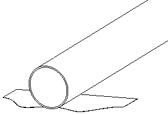

# Plantilla para corte boca de pez 

Este script permite generar una plantilla para hacer corte boca de pez, el script genera

- Plantilla PDF
- Archivo DXF
- Archivo SVG
- Archivo PNG `imagen previa`

##### FORMULAS APLICADAS

Las fórmulas aplicadas son las siguientes  
`Para Angulo 90 Grados perpendicular 
`

$$
\begin{equation}
\text{calculoDirectriz} = \text{radioBase} - \sqrt{\text{radioBase}^2 - (\sin(\text{anguloDirectriz}) \times \text{radioInjerto})^2}
\end{equation}
$$

`Para Angulo entre 0-89 Grados  
`

$$
\begin{equation}
\text{calculoDirectriz} = \left( \text{radioInjerto} + \cos(\text{anguloDirectriz}) \times \text{radioInjerto} \right) \times \tan(\text{anguloInclinacion}) + \frac{\text{radioBase} - \sqrt{\text{radioBase}^2 - (\sin(\text{anguloDirectriz}) \times \text{radioInjerto})^2}}{\cos(\text{anguloInclinacion})}
\end{equation}
$$

##### FORMULAS APLICADAS EN CODIGO

Las funciones donde describe las fórmulas están en

- Función para 90 grados
  > `calcular_directrices_90`
- Función para entre 0 y 89 grados
  > `calcular_directrices_45`
