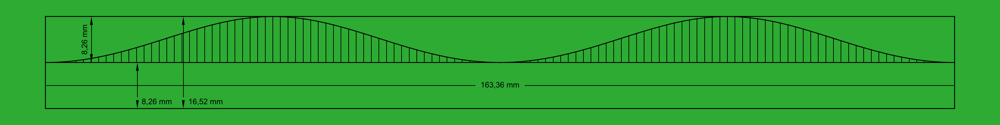

# Plantilla para corte boca de pez

Este script permite generar una plantilla para hacer corte boca de pez, el script genera

- Plantilla PDF
- Archivo DXF
- Archivo SVG
- Archivo PNG `imagen previa`

##### FORMULAS APLICADAS

Las fórmulas aplicadas son las siguientes  
`Para Angulo 90 Grados perpendicular 
`

$$
\begin{equation}
\text{calculoDirectriz} = \text{radioBase} - \sqrt{\text{radioBase}^2 - (\sin(\text{anguloDirectriz}) \times \text{radioInjerto})^2}
\end{equation}
$$

`Para Angulo entre 0-89 Grados  
`

$$
\begin{equation}
\text{calculoDirectriz} = \left( \text{radioInjerto} + \cos(\text{anguloDirectriz}) \times \text{radioInjerto} \right) \times \tan(\text{anguloInclinacion}) + \frac{\text{radioBase} - \sqrt{\text{radioBase}^2 - (\sin(\text{anguloDirectriz}) \times \text{radioInjerto})^2}}{\cos(\text{anguloInclinacion})}
\end{equation}
$$

##### FORMULAS APLICADAS EN CODIGO

Las funciones donde describe las fórmulas están en

- Función para 90 grados
  > `calcular_directrices_90`
- Función para entre 0 y 89 grados
  > `calcular_directrices_45`

##### VISOR DE ARCHIVOS DXF

Existe dos versiones del visor de archivos DXF, no están terminado como quisiera, pero funcionan de forma básica, cuando tenga tiempo lo termino.

- visor_dxf_v0.py
- visor_dxf_v1.py

##### INSTALAR LIBRERIAS

Para poder instalar la dependencia de Python está el archivo `requirements.txt` , espero no me falto ninguna

- `pip install -r requirements.txt`

##### COMO EJECUTAR

Los parametros requeriodos son

- `diametro_base` Diámetro del tubo o guadua que recibe el injerto, esto en milímetros
- `diametro_injerto` Diámetro del tubo o guadua que se injerta es donde se aplica la plantilla esto en milímetros
- `grosor_injerto` Grosor del del tubo o guadua del injerto , esto en milímetros
- `angulo_inclinacion` Angulo el cual une los dos tubos el base y el injerto , esto en grados
- `numero_divisiones` Número de líneas que arma la plantilla por defecto puede ser 120
- `numero_divisiones` Ancho de la línea, este sirve para cuando se genera el PDF o la imagen, que tan gruesas son las líneas en el grafico

El comando quedaría de la siguiente manera

`python generar_plantilla_arg.py  '--diametro_base' '87' '--diametro_injerto' '52' '--grosor_injerto' '1' '--angulo_inclinacion' '90' '--numero_divisiones' '120' '--ancho_linea' '1.5'`

Este comando permitir visualizar en 3 dimensiones `3d` el cómo se ve el corte

`python 3d_graph_template.py '--diametro_injerto' '52'`

##### RESULTADOS

[Ver archivo corte boca pez en PDF](screenshot/plantilla_corte_boca_pez.pdf)

> Imagen generada

> Valores de la plantilla

- angle_grades `Angulo directriz `
- axis_x_mm `Distancia entre cada sección del eje horizontal de la plantilla`
- axis_y_mm ` Distancia entre cada sección del eje vertical de la plantilla`
  > 
  > SVG generada, imagen vectorial
  > 
